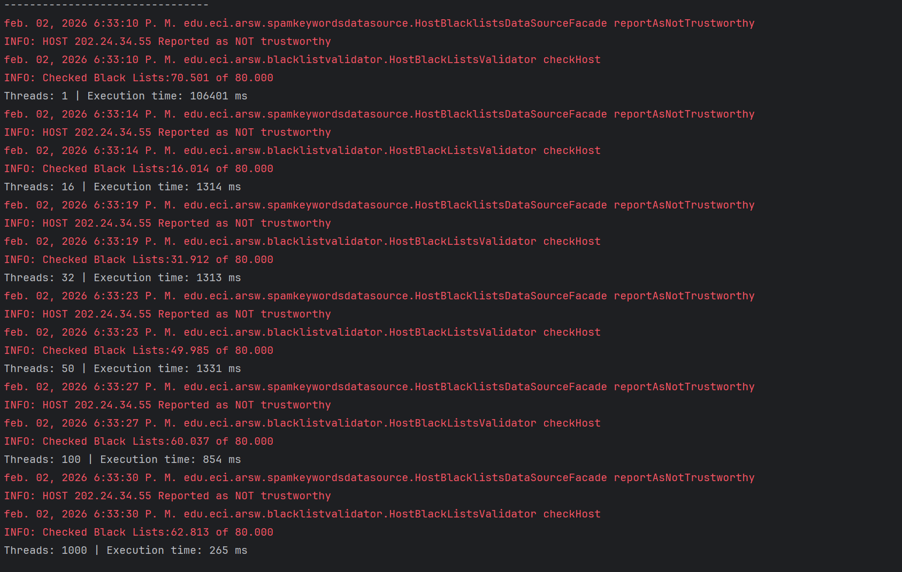
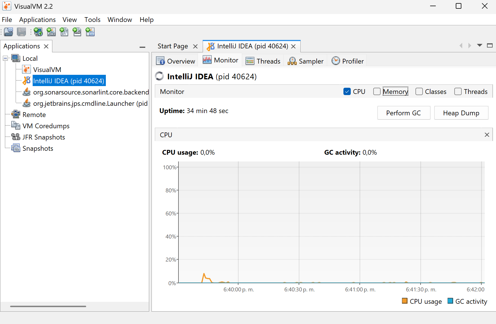
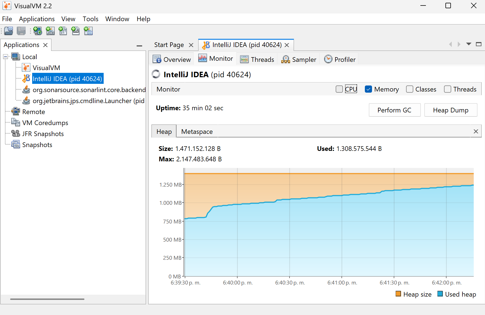

### Escuela Colombiana de Ingeniería
### Arquitecturas de Software - ARSW
## Ejercicio Introducción al paralelismo - Hilos - Caso BlackListSearch

## Marlio Jose Charry Espitia

### Dependencias:
####   Lecturas:
*  [Threads in Java](http://beginnersbook.com/2013/03/java-threads/)  (Hasta 'Ending Threads')
*  [Threads vs Processes]( http://cs-fundamentals.com/tech-interview/java/differences-between-thread-and-process-in-java.php)

### Descripción
  Este ejercicio contiene una introducción a la programación con hilos en Java, además de la aplicación a un caso concreto.
  

**Parte I - Introducción a Hilos en Java**

1. De acuerdo con lo revisado en las lecturas, complete las clases CountThread, para que las mismas definan el ciclo de vida de un hilo que imprima por pantalla los números entre A y B.
2. Complete el método __main__ de la clase CountMainThreads para que:
	1. Cree 3 hilos de tipo CountThread, asignándole al primero el intervalo [0..99], al segundo [99..199], y al tercero [200..299].
	2. Inicie los tres hilos con 'start()'.
	3. Ejecute y revise la salida por pantalla. 
	4. Cambie el incio con 'start()' por 'run()'. Cómo cambia la salida?, por qué?.
   

   RTA/: Al usar run() en lugar de start(), la salida se vuelve ordenada y secuencial, porque no se crean hilos nuevos: el método run() se ejecuta en el hilo main.
	   Con start(), los hilos se ejecutan en paralelo y la salida es intercalada y no determinista.

**Parte II - Ejercicio Black List Search**

Para un software de vigilancia automática de seguridad informática se está desarrollando un componente encargado de validar las direcciones IP en varios miles de listas negras (de host maliciosos) conocidas, y reportar aquellas que existan en al menos cinco de dichas listas. 

Dicho componente está diseñado de acuerdo con el siguiente diagrama, donde:

- HostBlackListsDataSourceFacade es una clase que ofrece una 'fachada' para realizar consultas en cualquiera de las N listas negras registradas (método 'isInBlacklistServer'), y que permite también hacer un reporte a una base de datos local de cuando una dirección IP se considera peligrosa. Esta clase NO ES MODIFICABLE, pero se sabe que es 'Thread-Safe'.

- HostBlackListsValidator es una clase que ofrece el método 'checkHost', el cual, a través de la clase 'HostBlackListDataSourceFacade', valida en cada una de las listas negras un host determinado. En dicho método está considerada la política de que al encontrarse un HOST en al menos cinco listas negras, el mismo será registrado como 'no confiable', o como 'confiable' en caso contrario. Adicionalmente, retornará la lista de los números de las 'listas negras' en donde se encontró registrado el HOST.

Al usarse el módulo, la evidencia de que se hizo el registro como 'confiable' o 'no confiable' se dá por lo mensajes de LOGs:

INFO: HOST 205.24.34.55 Reported as trustworthy

INFO: HOST 205.24.34.55 Reported as NOT trustworthy

Al programa de prueba provisto (Main), le toma sólo algunos segundos análizar y reportar la dirección provista (200.24.34.55), ya que la misma está registrada más de cinco veces en los primeros servidores, por lo que no requiere recorrerlos todos. Sin embargo, hacer la búsqueda en casos donde NO hay reportes, o donde los mismos están dispersos en las miles de listas negras, toma bastante tiempo.

Éste, como cualquier método de búsqueda, puede verse como un problema [vergonzosamente paralelo](https://en.wikipedia.org/wiki/Embarrassingly_parallel), ya que no existen dependencias entre una partición del problema y otra.

Para 'refactorizar' este código, y hacer que explote la capacidad multi-núcleo de la CPU del equipo, realice lo siguiente:

1. Cree una clase de tipo Thread que represente el ciclo de vida de un hilo que haga la búsqueda de un segmento del conjunto de servidores disponibles. Agregue a dicha clase un método que permita 'preguntarle' a las instancias del mismo (los hilos) cuantas ocurrencias de servidores maliciosos ha encontrado o encontró.

2. Agregue al método 'checkHost' un parámetro entero N, correspondiente al número de hilos entre los que se va a realizar la búsqueda (recuerde tener en cuenta si N es par o impar!). Modifique el código de este método para que divida el espacio de búsqueda entre las N partes indicadas, y paralelice la búsqueda a través de N hilos. Haga que dicha función espere hasta que los N hilos terminen de resolver su respectivo sub-problema, agregue las ocurrencias encontradas por cada hilo a la lista que retorna el método, y entonces calcule (sumando el total de ocurrencuas encontradas por cada hilo) si el número de ocurrencias es mayor o igual a _BLACK_LIST_ALARM_COUNT_. Si se da este caso, al final se DEBE reportar el host como confiable o no confiable, y mostrar el listado con los números de las listas negras respectivas. Para lograr este comportamiento de 'espera' revise el método [join](https://docs.oracle.com/javase/tutorial/essential/concurrency/join.html) del API de concurrencia de Java. Tenga también en cuenta:

	* Dentro del método checkHost Se debe mantener el LOG que informa, antes de retornar el resultado, el número de listas negras revisadas VS. el número de listas negras total (línea 60). Se debe garantizar que dicha información sea verídica bajo el nuevo esquema de procesamiento en paralelo planteado.

	* Se sabe que el HOST 202.24.34.55 está reportado en listas negras de una forma más dispersa, y que el host 212.24.24.55 NO está en ninguna lista negra.

**Parte II.I Para discutir la próxima clase (NO para implementar aún)**

La estrategia de paralelismo antes implementada es ineficiente en ciertos casos, pues la búsqueda se sigue realizando aún cuando los N hilos (en su conjunto) ya hayan encontrado el número mínimo de ocurrencias requeridas para reportar al servidor como malicioso. Cómo se podría modificar la implementación para minimizar el número de consultas en estos casos?, qué elemento nuevo traería esto al problema?

RTA/: Para reducir el número de consultas, se puede hacer que la búsqueda se detenga tan pronto como, entre todos los hilos, se alcance el número mínimo de ocurrencias requerido. Para esto, los hilos comparten un contador global y una condición de parada que les permite saber cuándo ya no es necesario seguir buscando. Así se evita continuar consultando listas negras innecesarias y se mejora el tiempo de ejecución, especialmente cuando las coincidencias aparecen temprano. Sin embargo, esto agrega un nuevo reto al problema, que es la sincronización entre hilos, ya que ahora existe información compartida que debe manejarse correctamente para evitar errores por condiciones de carrera.
**Parte III - Evaluación de Desempeño**

A partir de lo anterior, implemente la siguiente secuencia de experimentos para realizar las validación de direcciones IP dispersas (por ejemplo 202.24.34.55), tomando los tiempos de ejecución de los mismos (asegúrese de hacerlos en la misma máquina):

1. Un solo hilo.
2. Tantos hilos como núcleos de procesamiento (haga que el programa determine esto haciendo uso del [API Runtime](https://docs.oracle.com/javase/7/docs/api/java/lang/Runtime.html)).
3. Tantos hilos como el doble de núcleos de procesamiento.
4. 50 hilos.
5. 100 hilos.

Al iniciar el programa ejecute el monitor jVisualVM, y a medida que corran las pruebas, revise y anote el consumo de CPU y de memoria en cada caso. 

Con lo anterior, y con los tiempos de ejecución dados, haga una gráfica de tiempo de solución vs. número de hilos. Analice y plantee hipótesis con su compañero para las siguientes preguntas (puede tener en cuenta lo reportado por jVisualVM):

Los resultados muestran una mejora significativa al pasar de ejecución secuencial a paralela, evidenciando que el problema es altamente paralelizable. El mejor balance entre tiempo y uso de recursos se obtiene cuando el número de hilos es cercano al número de núcleos del procesador. Al incrementar excesivamente el número de hilos, el tiempo de ejecución disminuye debido a que las ocurrencias se encuentran más rápido y se activa la terminación anticipada, pero esto incrementa el consumo de CPU y memoria, como se observó en VisualVM. Esto demuestra que un mayor número de hilos no siempre implica una solución más eficiente en términos de recursos.
## Resumen de resultados

| Hilos | Listas revisadas     | Tiempo (ms) |
|------:|----------------------|------------:|
| 1     | 70.501 / 80.000      | 106.401     |
| 16    | 16.014 / 80.000      | 1.314       |
| 32    | 31.912 / 80.000      | 1.313       |
| 50    | 49.985 / 80.000      | 1.331       |
| 100   | 60.037 / 80.000      | 854         |
| 1000  | 62.813 / 80.000      | 265         |

Durante la ejecución de PerformanceMain se usó VisualVM para revisar el uso de CPU y memoria.

En la gráfica de CPU, el consumo se mantiene casi siempre en 0%, con algunos picos muy pequeños. Esto pasa porque las tareas que realiza el programa son muy rápidas, así que VisualVM no alcanza a mostrar diferencias claras entre los distintos números de hilos.

En cuanto a la memoria, se observa que el heap usado va creciendo de forma gradual, mientras que el tamaño máximo se mantiene estable. No se ven liberaciones grandes de memoria, lo que indica que los objetos creados durante la ejecución permanecen activos y no se activan ciclos fuertes de garbage collection.

En general, no se aprecian diferencias grandes en VisualVM porque las ejecuciones son cortas y la carga es baja. Por eso, el impacto del paralelismo se nota mejor en los tiempos de ejecución medidos, más que en las gráficas de CPU y memoria.

**Parte IV - Ejercicio Black List Search**

1. Según la [ley de Amdahls](https://www.pugetsystems.com/labs/articles/Estimating-CPU-Performance-using-Amdahls-Law-619/#WhatisAmdahlsLaw?):

	, donde _S(n)_ es el mejoramiento teórico del desempeño, _P_ la fracción paralelizable del algoritmo, y _n_ el número de hilos, a mayor _n_, mayor debería ser dicha mejora. Por qué el mejor desempeño no se logra con los 500 hilos?, cómo se compara este desempeño cuando se usan 200?. 
	
RTA/: Aunque la ley de Amdahl dice que entre más hilos haya, mejor debería ser el rendimiento, en la práctica esto no siempre pasa. Con 500 hilos, el programa pierde mucho tiempo creando, coordinando y cambiando entre hilos, en lugar de hacer trabajo útil. Esa sobrecarga hace que el rendimiento baje. Con 200 hilos, todavía hay bastante paralelismo, pero menos costo de gestión, así que el desempeño termina siendo mejor que con 500.
2. Cómo se comporta la solución usando tantos hilos de procesamiento como núcleos comparado con el resultado de usar el doble de éste?.

RTA/: Cuando se usan tantos hilos como núcleos del procesador, el programa aprovecha bien el hardware porque cada hilo puede ejecutarse al mismo tiempo. En cambio, al usar el doble de hilos, el sistema tiene que estar cambiando constantemente entre ellos, lo que genera sobrecarga y no trae una mejora real en el tiempo de ejecución.

3. De acuerdo con lo anterior, si para este problema en lugar de 100 hilos en una sola CPU se pudiera usar 1 hilo en cada una de 100 máquinas hipotéticas, la ley de Amdahls se aplicaría mejor?. Si en lugar de esto se usaran c hilos en 100/c máquinas distribuidas (siendo c es el número de núcleos de dichas máquinas), se mejoraría?. Explique su respuesta.

RTA/: Sí, en teoría funcionaría mejor. Usar 1 hilo en cada una de 100 máquinas permite un paralelismo más real, ya que no hay competencia por la CPU como en una sola máquina. Si se usan c hilos en 100/c máquinas, el rendimiento dependerá de cuántos núcleos tenga cada máquina y de qué tan bien se reparta el trabajo. En general, distribuir el procesamiento ayuda a superar las limitaciones de una sola CPU y permite escalar mejor el sistema.

